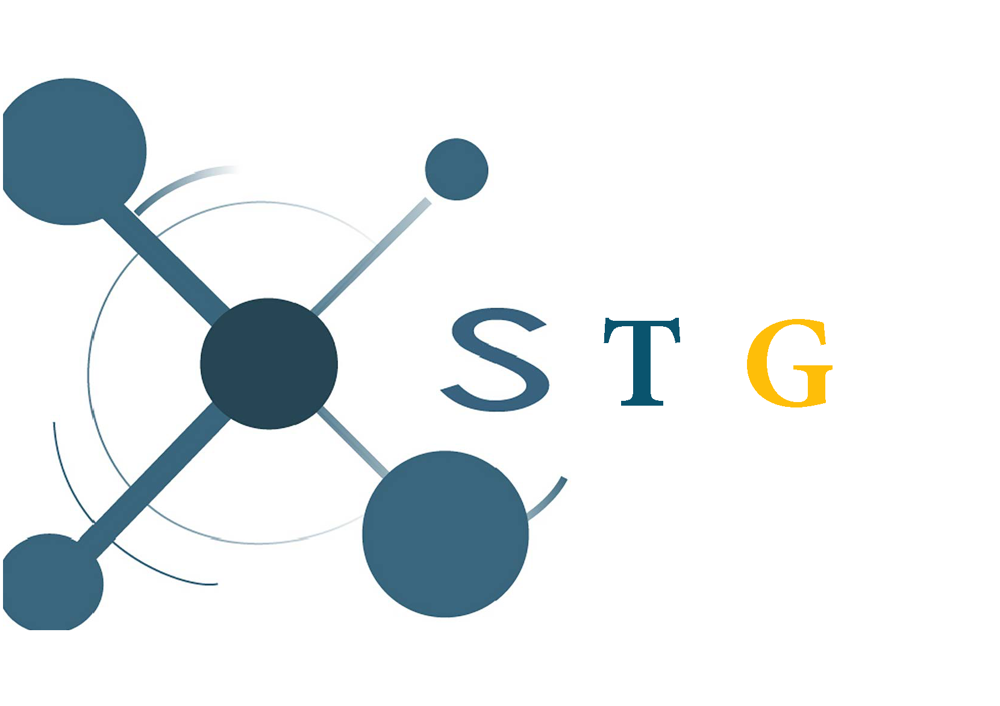

<p align="left">
  
</p>

# Automating SUMO traffic demand generation [STG] #

STG allows to SUMO users to quickly and easily execute generate traffic demnd for their own sceanrios (i.e., net file). 
This is an automation tool for SUMO that generate required confgiration files for SUMO tools. 
Based on SUMO templates structure, this tool reads templates folder and generate configration files  and execute simulations.
Required inputs include: SUMO valid installation, .ned (road network), real traffic (.csv), origin/destination zones (TAZs).
 
How to cite us 
--------------

If you use STG for your experiment analysis, we would appreciate a citation of our work:

* Pablo Barbecho Bautista, Luis Urquiza Aguiar, Mónica Aguilar Igartua, "How does the traffic behavior change by using SUMO traffic generation tools", Computer Communications, Vol. 181, pp. 1-13, January 2022, DOI: [https://example.com)10.1016/j.comcom.2021.09.023](10.1016/j.comcom.2021.09.023).


Feature highlights 
------------------

* Supports Python >= 3.5;
* Fine grane control of the SUMO traffic generation tools;
* Customizable/interactive plotting
* Runs parallelized simulations;


STG includes the following tool:    
```bash
  - run: Generates traffic demand based on the selected SUMO tool. Executes simulations.
```

```bash
    # stg run --help
    Usage: stg run [OPTIONS]
    
      STG SUMO Traffic generator. Required options: tool, -O, -D,
    
    Options:
      -s, --sumo-bin PATH          SUMO bin directory.
      -net PATH                    Net file converted to SUMO readable file (.net)
      -T, --real-traffic PATH      Path to real traffic file with .csv format.
      -O, --O-district-name TEXT   Origin district name as in TAZ file.
      -D, --D-district-name TEXT   Destination district name as in TAZ file.
      -o, --outputs PATH           Output directory (route traces, statistics).
      -ma                          MARouter SUMO tool
      -dua                         DUARouter SUMO tool
      -duai                        DUAIterate SUMO tool
      -rt                          RandomTrips SUMO tool
      -od2                         OD2Trips SUMO tool
      -i, --iterations INTEGER     DUAIterate number of iterations  [default: 1]
      -reroute                     Enable SUMO reroute capabilities.  [default:
                                   False]
    
      -gui                         Graffical interface for SUMO simulations
      -p, --max-processes INTEGER  The maximum number of parallel simulations. [
                                   default available cpus are used ]
    
      -t, --sim-time INTEGER       Number of hours to simulate  (e.g., 24 hours)
                                   [default: 1]
    
      -n, --repetitions INTEGER    Number of repetitions.  [default: 1]
      --help                       Show this message and exit. 
```

## Clone the repository ##
The STG package is developed using a pipenv. TO install osm on a virtual environment:
```bash
pip3 install pipenv
```

To clone the osm repository, on the command line, enter:
```bash
git clone https://github.com/Pbarbecho/STG.git
```
On the new venv, install osm project in an editable mode:

```bash
pipenv install -e stg/
```

Then, for use the new virtual environment instantiate a sub-shell as follows:

```bash
pipenv shell
```

At this time, you can interact with the STG modules.

## Downloading modules ##

Install osm using pip:
```bash
pip3 install --user -U https://github.com/Pbarbecho/osm/archive/master.zip
```

Depending on the operating system, you may need to add ~/.local/bin to your path. During the installation you will be warned about this.
 
 
In case you want to uninstall osm package: 

```bash
pip3 uninstall stg
```

## Authors ##

Pablo Barbecho
