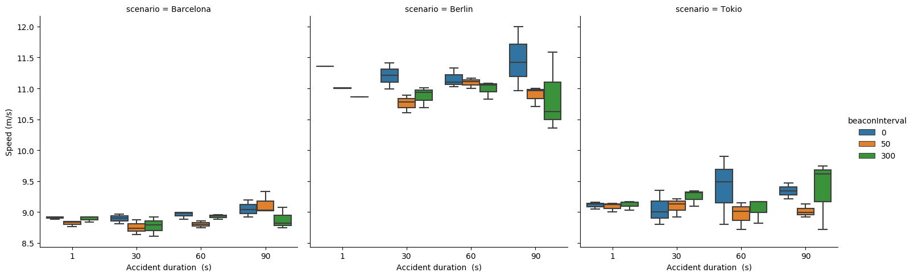

.. _cli:

Command Line Interface
======================

In order to easy use of OMNeT++ simulation manager (OSM), it includes a command line interface.
OSM cope with the typical tasks that includes the large-scale simulations workflow.

Getting help
------------

OSM cli comes with --help option. Each sub-commands are detailed below:::

  osm --help

  Usage: osm [OPTIONS] COMMAND [ARGS]...

    CLI OSM Simulation manager. Execute large-scale OMNeT++ simulations.

  Options:
    -v      verbose
    --help  Show this message and exit.

  Commands:
    analyzer  Customized filtering and plotting.
    launcher  Build the simulation campaign.
    parser    Merge result files into one single output file (.npy, .mat,...

Build and run the simulation campaign
--------------------------------------

Simulation campaign can be run through the launcher sub-command. The same command is used to pass users configurations as detailed below.
Once the launcher sub-command is executed, information of the build simulation campaign is prompted and the uset choices
to execute simulations. To extend information of osm launcher command usage, the --help flag can be used::

  $osm launcher --help

  Usage: osm launcher [OPTIONS] INIFILE MAKEFILE

    Build and run the simulation campaign.

  Options:
    --omnet-path PATH               OMNET++ installation directory.
    --output-dir PATH               Path to directory where results are saved.
    -n, --ned-files-dir TEXT        Path of NED files used in the model
                                    separated by ':' (e.g. .:../../src).
                                    Consider current directory is omnetpp.ini
                                    file.

    --max-processes INTEGER         The maximum number of parallel simulations.
                                    [ default available cpus are used ]

    -t, --sim-time INTEGER          Simulation time. Common for all scenarios in
                                    simulation campaign.  [default: 300]

    -r, --repetitions INTEGER       Number of repetitions.  [default: 1]
    -a, --analyze                   Analyze a group of files from a previous
                                    simulation campaign, looking for missing
                                    files.

    -add, --additional-files-path PATH
                                    Path to parameters studied file
                                    (variables.txt.csv) and structure file
                                    (structure.csv) files. [default: parents
                                    directory]

  --help                            Show this message and exit.

Two arguments are required:

    1. INIFILE -> The location of the project configuration file (omnetpp.ini)
    2. MAKEFILE -> Location of the executable file of the project.

As an option:

    - The location of the NED files required by the project should be passed. In case non path was pass, by default the current location (/) will be used.
    - In case of a custom recording of output files, the additional files directory (variables, and structure files) is required.
    - The OMNeT++ installation path, the output directory where simulation results will be save and the directory to additional files (structure and variables) in case of customized recording.

Example of launcher entry::

    osm -v launcher --max-processes 20 -t 500 -r 20 -n '.:../../src/veins/' -add ~/additionals/ --output-dir ~/results/  ~/veins/omnetpp.ini ~/veins/src/veins_executable

Simulation campaign summary::

 ============================
 Simulation campaign summary
 ============================

 Scenarios to simulate [scenario]: ['Barcelona', 'Berlin', 'Tokio']
 Iteration variables: 2 = [4, 3]
 Repetitions per scenario: 20
 Simulation time: 500s
 Total Runs: 720

 Build simulation campaign (*Y/N):

Parsing simulation results
--------------------------

The sub-command parser, can be used to merge into a unique output file simulation campaign results. The --additional-files-path or --add
includes the path to 'variables' and 'structure' files.

 - Variables file: Include the iteration variable with the set of values. The OMNeT++ syntax is used to declare iteration variables.::

   *.node[*0].veinsmobility.accidentDuration = {0, 50, 300}s
   *.node[*].appl.beaconInterval = {1, 30, 60, 90}s

 - Structure file: Include the structure (n-dimension) of results files. This file is pass in combination with the variable file to map columns with the corresponding parameter (Column name). Columns are listed separated wih a comma as follows::

    Type,NodeID,tx/rx,recAddress,Speed,MsgId,Length,CH,Time

Results are exported to any of the supported output formats .npy, .mat, .csv for later process within MATLAB or within the OSM analyzer.
Further details of parser command usage can be listed with the --help flag::

  $osm launcher --help

  Usage: osm parser [OPTIONS]

    Merge result files into one single output file (.npy, .mat, .csv).

  Options:
    --max-processes INTEGER         The maximum number of parallel simulations.
                                    By default available cpus are used.

    -i, --input-dir PATH            Directory containing simulations results.
    -o, --output-dir PATH           Path to directory where output file is
                                    saved.

    -O, --output-filename TEXT      Filename with supported extension .npy
                                    (Numpy), .mat (Matlab) or csv (Comma-
                                    separated values).

    -add, --additional-files-path PATH
                                    Path to iteration varibles and structure
                                    files. [default: parents directory]

    --help                          Show this message and exit.

In case of no input, output and max processes options are included with the parser command,
by default the installation path create the input folder we the simulation is launched. In the same manner, the output folder and file's name (results.csv) are created we parser command is executed without options. By default de maximum number of processes is used.
The following command, will try to automatically parse result files into an output file with sim.csv format::

    $osm parser --add ~/additionals/ --input-dir ~/results/ --output-dir ~/summary/sim.csv

Analyzing simulation results
----------------------------

The analyzer command includes a customizable python script. Here, parsed results files can be filtered and sorted for plotting.
The plotting phase is simplified by using the common structure of results (pandas dataframes). An interactive plotting is available with the option -itp. It try to automatically open a web browser (default firefox) where columns can be easily drag and drop to generate custom plots. Extended information is available with the --help flag::

    $osm analyzer --help
        Usage: osm analyzer [OPTIONS]

            Customized filtering and plotting.

        Options:
            -i, --input-cvs-file PATH       Input .csv file with merge results
            -o, --output-dir PATH           Path to directory where custom analyzed
                                            factors are saved.

            -plt, --interactive-pivot-table
                                            GUI in firefox to drag columns and plot
                                            resutls dataframe.

            --help                          Show this message and exit.

The output of the analyzer, includes figures and data used to generate plots::

    Files generated:
        0) summary_%PL_df.png
        1) summary_%PL_df.csv
        2) summary_speed.png
        3) summary_speed.csv

